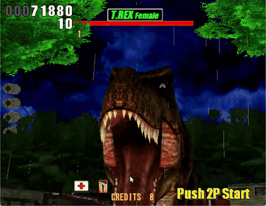

# lostworld



**The Lost World: Jurassic Park** (Sega, 1997) statically recompiled — the
game's PowerPC code becomes native C, linked against a Model 3 board.

The board is [model3recomp](https://github.com/sp00nznet/model3recomp), carried
here as a submodule. That repository is title-agnostic: nothing in it knows
what game it is running. This repository is the bring-up for one game — the
glue, the pipeline, and the notes on what this particular title needs.

That split is the house style across the sp00nznet recomp projects: one core
toolkit per board, one repository per game. `virtuacop` and `daytonausa` sit
the same way on top of `model2recomp`.

## Status

**Playable. The game boots, runs its whole attract cycle, takes a credit and
plays through stage one to the T-Rex, aimed and fired with the mouse.**

| | |
|---|---|
| Boots from the reset vector, runs from RAM as native code | yes |
| I/O board, VBlank, PCI, SCSI DMA to the Real3D | yes |
| Agrees with the interpreter, access for access | yes |
| Tilemaps: scroll, line scroll, layer masks, fades | yes |
| **Attract mode, complete** — logo, "something has survived", title, rankings, demo | **yes** |
| Real3D: textured, lit, translucent, filtered | yes |
| Textures from the FIFO and from VROM, all twelve formats | yes |
| Coin, start, light gun aim, trigger, reload | yes |
| **Stage one, played through and the T-Rex beaten**; stage two reached | **yes** |
| Held to the board's 57.524 Hz | yes |
| Menu bar: video, controls, cursor, cheats, multiplayer | yes |
| Gamepad and Sinden light gun | yes |
| Save states, exact across runs | yes |
| **Two players over the network** — LAN, Tailscale, forwarded port | **yes** |
| High scores and settings kept between runs | yes |
| **In English** — the US attract and text from the Japanese board, by region | **yes** |
| HUD: ammunition counter, RELOAD prompt, pickups, the T-Rex's target circles | yes |
| Cheats: infinite health, endless ammo, either player; add credits | yes |
| Two players across two real machines on a LAN, frame-identical | yes |
| **Sound** — music and effects, matching MAME | **yes** |

### Known issues

- **Some scenes are washed out.** A translucent mist layer is drawn too strong
  in places, the start of the T-Rex encounter among them.
- Mipmaps are not used, so distant surfaces shimmer, and there are small
  graphical errors here and there -- stray polygons, the odd wrong texture.

### What fixed it

Most of what stood between attract mode and a playable game was in the board,
and every fix below came from comparing against
[Supermodel](https://github.com/trzy/Supermodel)'s source rather than from
guessing at the hardware:

| | was | is |
|---|---|---|
| Tilemap register `0x20` | depth and priority nibbles swapped | the title logo and credits roll decode |
| Tilemap scroll | not implemented | scroll, per-line scroll, A/A' stencil, colour offsets (fades, lightning) |
| Polygon translucency | drawn opaque | a 40% mist sheet stops hiding the title sequence |
| Culling node siblings | given the node's own transform | a stray cyan shape leaves the demo |
| Per-node texture offset | ignored | models get their own skins |
| VROM texture address | 16-bit units | 32-bit words: the jungle, the village, the trees |
| Texture type byte | ignored | mip-only loads stop overwriting the textures they belong to |
| Texel formats | one of twelve | greyscale and alpha formats, tinted by polygon colour |
| Light gun | fixed at the centre | the mouse, on Supermodel's 150..651 x 80..465 calibration |
| Viewport priority | drawn in list order | the HUD viewport (priority 3) on top: ammo counter, RELOAD, pickups |
| Serial EEPROM | a toggle that only passed the boot | a real 93C46, where the game keeps its settings and country |

The full bring-up story -- the boot, the stalls, the ROM layout, and the
dead ends -- is in [docs/technical/bring-up.md](docs/technical/bring-up.md).

The lift itself is in good shape, and the evidence is differential rather than
anecdotal: run the same boot through `model3recomp`'s interpreter and through
the recompiled binary, and the two device-access traces agree access for
access for the first 26,440 of them. Where they part is not a disagreement
about any device — it is *when* the field boundary falls, because the
interpreter paces fields off an instruction count and the runtime paces them
off guest work.

## What you need

- **model3recomp's** prerequisites: CMake 3.20+, a C17 compiler, Python 3.9+,
  optionally SDL2.
- **A Lost World romset you dumped or own.** None is included here, and none
  ever will be. Neither is any recompiled output — that is generated on your
  machine from your dump and is gitignored.

## Getting started

```
git clone --recurse-submodules https://github.com/sp00nznet/lostworld.git
cd lostworld
```

### 1. Build the ROM images

```
python tools/build_roms.py /path/to/lostwsga.zip roms/
```

This works out which chips are the program ROMs by trying interleaves and
checking the result against the PowerPC exception vector table, so it proves
the layout rather than assuming it:

```
program EPROMs : epr-19936.20, epr-19937.19, epr-19938.18, epr-19939.17
maps at        : 0xFFE00000
reset vector   : 0xFFF00100
verified       : 7/7 exception vectors
banked CROM    : roms/lw_bank.bin  (0x4000000 bytes from 16 chips)
VROM           : roms/lw_vrom.bin  (0x2000000 bytes from 16 chips)
sound          : roms/lw_snd.bin  (0x80000 bytes from 1 chip)
samples        : roms/lw_samples.bin  (0x800000 bytes from 2 chips)
```

If you built the images before sound arrived, run it again: the last two
are new.

### 2. Recompile the game

```
python tools/lift.py
```

This boots the machine in an interpreter first, because Model 3 games do not
run from ROM — see [docs/technical/bring-up.md](docs/technical/bring-up.md).
It writes `src/recomp/`, which is **not** committed.

### 3. Build and run

```
cmake -S . -B build
cmake --build build --config Release
./build/lostworld
```

With SDL2 the game runs in a window; without it the build is headless and
only writes screenshots. If SDL2 is installed through vcpkg, point CMake at
it:

```
cmake -S . -B build -DCMAKE_TOOLCHAIN_FILE=<vcpkg>/scripts/buildsystems/vcpkg.cmake
```

| Input | Does |
|---|---|
| mouse | aim (the pointer is hidden, as on the cabinet; Controls > Cursor for a crosshair) |
| left click, or Space | fire |
| right click, or Left Shift | reload — points off screen and pulls the trigger |
| **5** / **6** | coin 1 / coin 2 |
| **1** / **2** | start 1 / start 2 |
| gamepad | left stick aims, A or RT fires, B or LT reloads, Start, Back for a coin |
| **F5** / **F7** / **F6** | save state / load state / next slot |
| **F11**, Alt+Enter | fullscreen |
| Tab (held) | run flat out |
| **F2** / **F3** | test / service |
| Escape | leave fullscreen, or quit |

The menu bar has the rest:

| Menu | |
|---|---|
| File | save and load state, slots 1–9, reset, quit |
| Video | window size, fullscreen, sharp or bilinear, scanlines, 4:3 or square pixels |
| Sound | mute (F9), volume |
| Controls | mouse, gamepad as player 1 or 2, cursor hidden / crosshair / pointer, a white border for a **Sinden** light gun (run its software in mouse mode, off-screen reload on the right button) |
| Debug | infinite health and endless ammo for either player; add credits; and the cabinet's operator settings, each of which restarts the game: **Region** (USA by default, Export, Australia, Japan), **Difficulty** (1-16), **Starting life** (1-9), **Boss action**, **Attract sound**, **Free play** |
| Multiplayer | host, join, disconnect, input delay |

Settings live in `lostworld.ini`, high scores and the operator settings in
`lostworld.nv`, save states in `lostworld.<slot>.m3s`.

### In English

The only dump of this game is the Japanese board, `lostwsga`, and no
American set has ever surfaced. It doesn't need one: the program carries
every region -- Japan, USA, export, Australia -- and picks its text from a
country byte in its EEPROM settings. The game resets that byte from the
board's region at boot, so the Region setting (Debug menu) sets it again
from then on; changing it restarts the game, as an operator would.
With USA, attract mode gains the American screens (the parental advisory
card, "Winners Don't Use Drugs"), and the subtitles, the how-to-play panel
and the RELOAD prompt are in English.

### Two players over the network

One machine hosts and plays player 1; the other joins as player 2. Use the
Multiplayer menu, or the command line:

```
./build/lostworld --host 7777
./build/lostworld --join 192.168.1.20:7777        # or a Tailscale name or address
```

The host's port has to be reachable: on a LAN it is, over Tailscale it is,
and across the internet it needs forwarding (TCP). The game restarts for both
when they connect -- a session starts at power-on -- and runs in lockstep, so
the two machines stay frame-identical; the title bar says so if they ever
stop being. Input delay (Multiplayer > Input delay) trades latency for
smoothness: 1–2 fields on a LAN, more over distance.

### Scripting it

For captures and the build farm, everything is reachable without a person:
`M3_NOTHROTTLE=1` runs flat out; `M3_COIN_AT` / `M3_START_AT` press coin and
start at a field; `M3_FIRE_EVERY=N` pulls the trigger; `M3_GUN_X` / `M3_GUN_Y`
pin the gun to raw board coordinates (X 150..651, Y 80..465);
`M3_NETPLAY=host:PORT` or `join:ADDR:PORT` starts a session;
`M3_STATE_SAVE_AT=<field>` and `M3_STATE_LOAD=<slot>` save and load;
`M3_SHOT_EVERY=N,DIR` and `M3_RAM_EVERY=N,DIR` write frames and RAM;
`M3_CHEATS` and `M3_OPTIONS` set the Debug menu's cheats and region. The same
variables can come from a file, `--env FILE`, and the ROM images from
another folder, `--roms DIR`.

Pass a field count to capture a screenshot and exit, which is what the
conformance runs do:

```
./build/lostworld 600      # writes shot.ppm after 600 fields
```

## When it stops making progress

A recompiled game has no program counter to inspect, so the runtime reports
what it can:

| Symptom | What it means |
|---|---|
| `no function lifted at XXXXXXXX` | an indirect target the lifter missed — collect them and re-run `tools/lift.py --entries` |
| `unimplemented <mn> at XXXXXXXX` | an instruction the lifter does not translate |
| `N device accesses with no field advance` | the guest is polling one register forever; the report names it |
| nothing at all, frames ticking | the guest fell out of lifted code — check `M3_TRACE_CALLS=40` |

## License

MIT — see [LICENSE](LICENSE).

No ROMs, dumps, recompiled source, symbol maps or anything else derived from
the game binary is in this repository, and none ever will be. The tools ship;
the output does not.
