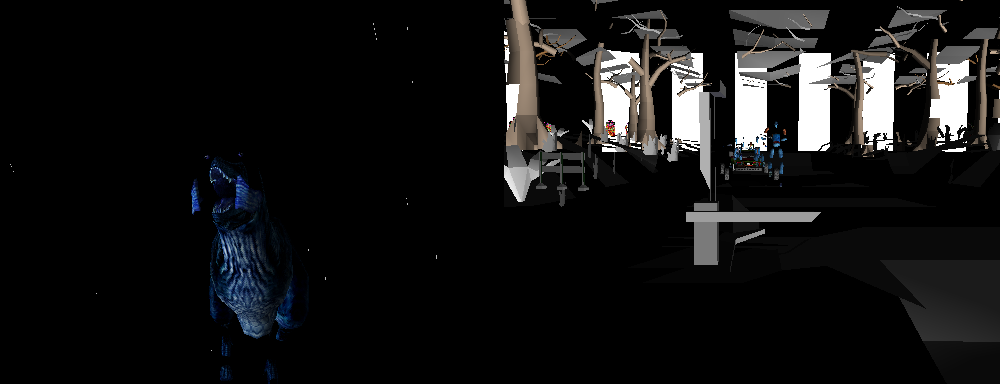

# lostworld



Left: the tile generator. This one is pixel-exact -- the same bytes as MAME
renders, checked frame against frame.

Right: the Real3D layer, one field out of an attract-mode shot — the
game's own geometry, transforms, per-vertex normals, lighting and textures.
It is a dark scene and it renders dark. No environment geometry is present
in the scene the game builds; what surrounds the subject is textured
quads.

**The Lost World: Jurassic Park** (Sega, 1997) statically recompiled — the
game's PowerPC code becomes native C, linked against a Model 3 board.

The board is [model3recomp](https://github.com/sp00nznet/model3recomp), carried
here as a submodule. That repository is title-agnostic: nothing in it knows
what game it is running. This repository is the bring-up for one game — the
glue, the pipeline, and the notes on what this particular title needs.

That split is the house style across the sp00nznet recomp projects: one core
toolkit per board, one repository per game. `virtuacop` and `daytonausa` sit
the same way on top of `model2recomp`.

## Status

**Alpha. The game boots, runs as native code, and reaches its main entry.
The Real3D renderer is not written, so there is still nothing 3D to see.**

| | |
|---|---|
| Boots from the reset vector | yes |
| Copies itself into RAM and runs from there | yes |
| Completes I/O board init | yes |
| Takes VBlank interrupts | yes |
| Runs SCSI DMA to the Real3D | yes |
| Writes tilemap VRAM | yes |
| Renders those tiles to a framebuffer | yes |
| Agrees with the interpreter, access for access | yes |
| Finds its PCI devices | yes |
| Clears the Sega region warning screen | yes |
| Reaches the game's main entry at RAM `0x30` | yes |
| **Installs and runs the frame task `0x1578`** | **yes** |
| Runs that task every field, in the interpreter and natively | yes |
| **Draws its own text, legibly** | **yes** |
| Submits 3D geometry | no -- see below |
| **Attract mode, drawn** | **not yet** |

The 2D tilemap pipeline runs end to end — ROM to lifted C to native execution
to VRAM to readable pixels. The game draws its own region warning screen and
its boot report, and both can be checked word for word against the strings in
the ROM:

```
             W A R N I N G

 THIS GAME IS TO BE USED ONLY IN JAPAN.
    EXPORT,SALES,DISTRIBUTION AND/OR
    OPERATION OUTSIDE THIS AREA MAY
CONSTITUTE A VIOLATION OF INTERNATIONAL
  LAWS ON COPYRIGHTS AND/OR INDUSTRIAL
    PROPERTY RIGHTS AND SUBJECT THE
 VIOLATING PARTY TO LEGAL PROCEEDINGS.
         SEGA ENTERPRISES,LTD.
```

That is worth more than it looks. A tilemap decode has several orderings in
it and a wrong one still draws *something*; text whose wording is known in
advance is the only cheap way to tell a right answer from a plausible one.
The previous decode read the scroll table as a name table and drew one tile
over the entire screen.

The lift itself is in good shape, and the evidence is differential rather than
anecdotal: run the same boot through `model3recomp`'s interpreter and through
the recompiled binary, and the two device-access traces agree access for
access for the first 26,440 of them. Where they part is not a disagreement
about any device — it is *when* the field boundary falls, because the
interpreter paces fields off an instruction count and the runtime paces them
off guest work. The divergence is the interrupt handler running a few accesses
earlier on one side than the other.

### What was blocking it

The game used to settle into its **operator service menu** instead of starting.
Per-frame work is dispatched through ten callback slots at RAM
`0x001EED7C..0x001EEDA0`, and slot `0x001EED80` never received the frame task
`0x1578` -- it held the null stub `0x00117864` for every field observed.

Three board-level faults were in the way, each hiding the next. All three are
fixed; the notes below are what they were, because none of them announced
itself and the first two had been wrongly ruled out.

**1. PCI configuration space did not exist.** The game will not come up until
it finds two devices by ID, through the MPC105's port pair at `0xF0800CF8`
and `0xF0C00CFC`:

| device | must answer | |
|---|---|---|
| 13 | `0x16C311DB` | Sega Real3D |
| 14 | `0x00011000` | LSI 53C810 |

The device-13 arm is what sets the readiness flag at RAM `0x6FB`, and
`0x001179C8` spins on that flag forever without it. Both devices already live
at fixed addresses here, so the BAR writes that follow are dropped.

**2. The Real3D status register was a constant.** The boot copies nine dwords
from `0x84000000` into RAM with `stwbrx` -- the chip is on the PCI side, so
the cached copy is byte-reversed -- and then waits for bit `0x02000000` of
that copy to flip. Byte-reversed, that is bit 1 of the register. A constant
never flips. It is toggled per read now, which is all the wait needs.

**3. A malformed SCRIPTS program was zeroing work RAM.** `src/scsi.c` already
refused memory moves whose source or destination was not mapped;
`tools/ppc_interp.py` did not, and performed them. A bulk write through the
`0xC0000000` window kicks SCRIPTS with garbage DSP values -- the register
image is written a word at a time and one word lands on offset `0x2C` -- and
one of the resulting moves, `2C022031 -> 00000980, 8064 bytes`, zeroed RAM
`0x980..0x2900`. That range holds `[0x00000E5C]`, the boot console's text
buffer pointer. Three hundred fields later the Sega region warning screen
tore itself down with `memset([0x00000E5C], 0, 8KB)`, and with the pointer
zeroed that wiped RAM `0x0..0x2000` -- including the init chain at `0x30`.

With those three fixed the boot runs to completion:

| | field |
|---|---|
| RAM `0x30`, the tail jump to main | 369 |
| `0x00001934`, the installer | 369 |
| `0x00001984`, the `[0x001A3474] == 0` guard | 377 |
| `0x000019A8`, the install site | 377 |
| `0x00001578`, the frame task running | 378 |

The 299-field pause in the middle is not a fault: it is the Sega region
**WARNING** screen, displayed for about five seconds by design.

`tools/ppc_interp.py --break-at ADDR` reports whether execution ever reaches
an address, and is repeatable, so one run answers a whole call chain. That is
how each of these was found.

### Where it stops now

The frame task runs every field, the interrupt path is healthy, and the game
draws its text. Then it stops making progress, and the reason is not the one
it first appears to be.

The most recent thing found and fixed was the **decrementer**. The game's
timing calibration waits on a counter at RAM `0x001C10D0`, and the only code
that writes it is the handler the game installs at exception vector `0x900` —
a pointer that appears nowhere in RAM, because the processor calls it rather
than the game. `model3recomp` had no decrementer, so that wait could never
end; the interpreter and the recompiled binary sat in it forever and agreed
exactly, which is what ruled out a lifter bug. With SPR 22 counting down and
its `0 -> -1` crossing taking the exception, the counter advances.

It still does not reach attract mode, and the reason is now narrow enough to
state exactly. Instrument every guest function entry rather than only the
indirect dispatches and the frame is legible:

| | |
|---|---|
| Frame task `0x1578` | runs every field |
| Real3D triggered | ~476 times per 2,500 fields, by DMA of a 4-byte word |
| Culling RAM written | 23 small transfers, all in the first second |
| Polygon RAM written | never |
| Upload FIFO at `0x94000000` | 464 transfers — a gamma ramp, re-sent every frame |
| Tilemap | deliberately blank after the boot report |

So the guest is not stalled in the sense of being stuck in a loop: it runs a
frame, sets its colour ramp, triggers the renderer, and does it again. It just
never sends any geometry. The blank screen after the boot report is the game's
own doing, not a renderer that cannot draw.

One real fault was found along the way and fixed: the FIFO above is a single
port rather than an address window, and the DMA range check had been rejecting
every transfer to it, because a thousand bytes to one address looks like a
thousand bytes off the end of it.

### The nearest thing to a cause

Tracing the code that *would* submit geometry gets to something specific.
Polygon RAM is written from exactly one place, `0x0010FC14`, which stages a
scene at RAM `0x001BAA50` and DMAs it to `0x98001000`. That is called only
from `0x00001A64`, which has four callers — `0x000022CC`, `0x000298A4`,
`0x00029D64`, `0x000A70DC` — and **none of the four ever runs**, so the whole
path is dormant.

Upstream of that, the game's own OS dispatches a callback slot only when the
matching bit is set in the flags word at RAM `0x000007F4`:

```
001183C4  lwz    r11, [0x000007F4]
001183C8  andis. r0, r11, 0x1000       ; bit 0x10000000
001183D8  bc     -> 0x001183FC         ; clear: skip the task entirely
001183E0  lwz    r9, [0x001EED98]      ; else call what is in that slot
001183F4  blrl
```

Slot `0x001EED98` holds a real task, `0x00032B2C`. Its bit is never set —
`[0x000007F4]` reads `0x20000800` from the first field to the ten-thousandth
— so that task has never once run. The OS sets these bits at `0x00116E04`.

Forcing the bit is not the fix and was tried: the task still does not start
and the scheduler comes apart, which says the task has to be *started*
properly rather than merely marked. Forcing it once rather than every field
does work, and draws the operator test menu — so the dispatch mechanism and
the tilemap are both fine, and that slot holds the service menu rather than
anything to do with attract mode.

### The ROM images were built wrong

`mame -listxml lostwsga` gives the authoritative layout, region by region and
offset by offset, and `model3recomp`'s loader disagreed with it in a way that
size checks cannot catch. The obvious reading is the wrong one:

| | was | is |
|---|---|---|
| banked CROM | sixteen **2 MB** parts, 32 MB | sixteen **4 MB** parts, **64 MB** |
| VROM | sixteen **4 MB** parts, 16-lane | sixteen **2 MB** parts, **8-lane** |
| group order | chip-number order | reversed (CROM), pairs swapped (VROM) |

Both images came out the right size either way, so nothing complained, and
the game read plausible nonsense rather than nothing — which is worse, because
it gets further before going wrong. The corrected banked CROM is verified
chip by chip against MAME's layout: each part lands exactly where that layout
puts it, byte-swapped, eight bytes apart.

It also settles something the guest had been saying all along. 64 MB in an
8 MB window is **eight** banks, not four — which is why it writes `F0`
through `F7`, values no four-bank reading could account for.

### Six megabytes of the data ROM were never mapped

The one measured with MAME rather than reasoned about. Run the game under
MAME, read its memory back, and the CROM map is plain:

| CPU address | what is there |
|---|---|
| `0xFF000000`–`0xFF7FFFFF` | zeros — on real hardware too |
| `0xFF800000`–`0xFFDFFFFF` | the data image, offset 0 onward, **unbanked** |
| `0xFFE00000`–`0xFFFFFFFF` | the 2 MB program |

`model3recomp` had nothing at all in the middle span, so a game asking for its
own tables got zeros. This one reads `0xFFA18DEC`, where the image holds an
`"M3"`-tagged record, and found none of it. Now mapped, and checked address by
address against MAME: `0xFF800000` is offset 0, `0xFFC00000` is `0x400000`,
`0xFFDFFFF0` is `0x5FFFF0`.

It also closes the bank-register question: driving that register through all
256 values under MAME moves none of this. The span is not banked, so no
reading of those bits was ever going to be the answer — which is why none of
the two dozen tried worked.

### What the game should be showing, and where it stops

`mame -listxml` was useful; running MAME is better. It plays this game on this
machine, so the question "what should be on screen at this point" has an
answer rather than a guess. Two things fall straight out of that.

The first is a check on the tilemap work above: MAME's frame 300 has **3,757**
non-black pixels and its frames 600 and 900 have **838** — the same counts
this port produces, exactly. The 2D pipeline agrees with a reference
implementation pixel for pixel on both screens it can draw.

The second is where it stops. MAME's attract mode begins around frame 1,200
with a credits line at the bottom of the screen, and by frame 3,300 it is
showing a ranking table — *drawn with the tilemap*, not the Real3D. So attract
mode is partly reachable without a renderer at all.

Comparing the two machines at the same point:

| | |
|---|---|
| work RAM, in the ranges dumped | **904 of 969** non-zero words identical |
| flags word, game mode, scissor, callback slots | identical |
| the tilemap copy at `0x0002CC04` | MAME runs it repeatedly, this runs it **once** |
| its gate at RAM `0x001C1B70` | set by the game's text-drawing calls, which MAME makes and this does not |
| the credits line | MAME writes rows 43-44; this writes rows 0-1 |

So the two are in very nearly the same state, and the gap is that the attract
sequence does not drive the text API.

Following that upward: the text calls come from the game's state handlers, in
a table at RAM `0x0011E6A4` indexed by `[0x001A3BB4] & 7`. That state is `0`
in both machines, so both should be running the handler at `0x00001EB8` — and
the dispatcher that would call it is the game's own main loop:

```
00001A14  bl 0x00001EF4     ; dispatch one state
00001A18  b  0x00001A0C     ; forever
```

**That loop used to go round once here, and now it turns.** Its last call is `0x00118340`, which waits
at `0x0011837C` for RAM `0x001C10D0` to change, and only the decrementer
handler writes that word. The handler does run — 43 times in a 3,000-field
run — and the word does change, but the wait is 568 million iterations of that
one branch, by far the hottest in the program.

It was not the decrementer's rate — sweeping that over four orders of
magnitude left the iteration count identical to the digit. It was the **time
base**.

`mftb` advanced one tick per *read*, which is not a clock: its value depended
on how often the guest looked at it rather than on how much time had passed.
This game times an interval with it and divides to get its decrementer period,
and computed **−26** where the hardware gives **26,926**. So the decrementer
never fired again, the wait never ended, and the state handler ran once
instead of once a field. The other end of the same measurement was the Real3D
frame flag, which flipped per read rather than per frame — a shortcut taken
deliberately, marked "upgrade path: flip it when the Real3D actually retires a
frame", and now come due.

With both fixed the machine comes alive:

| | before | after |
|---|---|---|
| timing routine `0x00118340` | 1 | **2,059** |
| tilemap copy `0x0002CC04` | 1 | **2,059** |
| state handler `0x0001D68C` | 1 | **2,060** |

The game now runs its own state machine once a field, in state 0, the same
state MAME is in. What it still does not do is drive its text calls, so the
credits line MAME draws is not drawn here yet.

Meanwhile the frame task keeps running, because it arrives by interrupt rather
than through this loop — which is why fields advance and the screen updates at
all while the main loop is stuck. That also defeats the field-advance loop
guard, so the backward-branch histogram is what found this. That is a narrower thing to chase than
anything before it, and the method for chasing it now exists: MAME's memory
taps name the code that writes a given address, and its RAM can be diffed
against this port's word for word.

### Earlier suspicion: the banked window

The banked CROM window is 8 MB of a 32 MB image, so at most two bits of the
register at `0xF0100008` can be the bank. `model3recomp` shifted the whole
byte, and this game writes `0xF7` for most of its run — which lands at offset
`0xF700000`, far outside the image. Every read through the window then returns
zero: **299,984 of them in a 2,500-field run, about 1.2 MB of the game's own
data.** `tools/rom_loader.py` warns of precisely this in a comment, and the
symptom is what it predicts.

That is very likely why nothing is drawn: the object and model tables the
attract sequence would walk are read as zeros, so there is nothing to submit.

One fix that this needed is in and correct: the register read back a value
derived from the bank *offset*, which agrees with what was written only while
the mapping is a plain shift — so every attempt to correct the mapping wedged
the boot in the spin that waits for the readback, and looked like a different
bug. Register and offset are separate now.

The mapping itself is still unknown and is deliberately left alone rather than
guessed at. `M3_TRACE_BANK` reports the access pattern — this game reads
window offsets `0x000000`, `0x010000`, `0x120000`, `0x150000` and `0x400000`
under registers `F1`, `F2`, `F3` and `F5` — and `M3_CROM_BANK` selects between
candidate readings. Every candidate tried so far leaves the game worse off
than zeros do, which says it is finding wrong data rather than none.

**There is no 3D scene to draw, which is why the Real3D renderer is not the
next thing to write.** Dump the scene memory and the picture is unambiguous:

| | |
|---|---|
| Culling RAM, high | a viewport node and an LOD table — real, and frozen |
| Culling RAM, low | never written |
| Polygon RAM | never written |
| The node area | 98.7% one repeated constant, `0x00800800` |

So the guest has set the Real3D up — the viewport node at offset 0 holds
believable frustum plane normals as little-endian floats, `0.2588` and
`0.9659` among them — and then submits no models at all. A rasteriser written
today would walk an empty node list and draw nothing. The blocker is the
frozen counter above, not the renderer.

`M3_LOOP_GUARD` is how the last stall was found. A recompiled game has no
program counter to inspect, so a build with it defined reports the guest
address a wedged game is spinning at; that is what named `0x0011837C`, a wait
on a RAM word that only an interrupt handler writes.

## What you need

- **model3recomp's** prerequisites: CMake 3.20+, a C17 compiler, Python 3.9+,
  optionally SDL2.
- **A Lost World romset you dumped or own.** None is included here, and none
  ever will be. Neither is any recompiled output — that is generated on your
  machine from your dump and is gitignored.

## Getting started

```
git clone --recurse-submodules https://github.com/sp00nznet/lostworld.git
cd lostworld
```

### 1. Build the ROM images

```
python tools/build_roms.py /path/to/lostwsga.zip roms/
```

This works out which chips are the program ROMs by trying interleaves and
checking the result against the PowerPC exception vector table, so it proves
the layout rather than assuming it:

```
program EPROMs : epr-19936.20, epr-19937.19, epr-19938.18, epr-19939.17
maps at        : 0xFFE00000
reset vector   : 0xFFF00100
verified       : 7/7 exception vectors
banked CROM    : roms/lw_bank.bin  (0x4000000 bytes from 16 chips)
VROM           : roms/lw_vrom.bin  (0x2000000 bytes from 16 chips)
```

### 2. Recompile the game

```
python tools/lift.py
```

This boots the machine in an interpreter first, because Model 3 games do not
run from ROM — see [docs/technical/bring-up.md](docs/technical/bring-up.md).
It writes `src/recomp/`, which is **not** committed.

### 3. Build and run

```
cmake -S . -B build
cmake --build build --config Release
./build/lostworld
```

With SDL2 the game runs in a window; without it the build is headless and
only writes screenshots. If SDL2 is installed through vcpkg, point CMake at
it:

```
cmake -S . -B build -DCMAKE_TOOLCHAIN_FILE=<vcpkg>/scripts/buildsystems/vcpkg.cmake
```

Cabinet buttons are on the keys an arcade front end would use: **5** and
**6** insert coins, **1** and **2** are the start buttons, **F2** is test and
**F3** service. Escape quits.

Pass a field count to capture a screenshot and exit, which is what the
conformance runs do:

```
./build/lostworld 600      # writes shot.ppm after 600 fields
```

## When it stops making progress

A recompiled game has no program counter to inspect, so the runtime reports
what it can:

| Symptom | What it means |
|---|---|
| `no function lifted at XXXXXXXX` | an indirect target the lifter missed — collect them and re-run `tools/lift.py --entries` |
| `unimplemented <mn> at XXXXXXXX` | an instruction the lifter does not translate |
| `N device accesses with no field advance` | the guest is polling one register forever; the report names it |
| nothing at all, frames ticking | the guest fell out of lifted code — check `M3_TRACE_CALLS=40` |

## License

MIT — see [LICENSE](LICENSE).

No ROMs, dumps, recompiled source, symbol maps or anything else derived from
the game binary is in this repository, and none ever will be. The tools ship;
the output does not.
